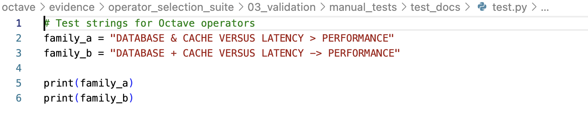
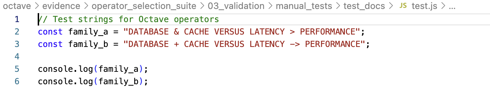
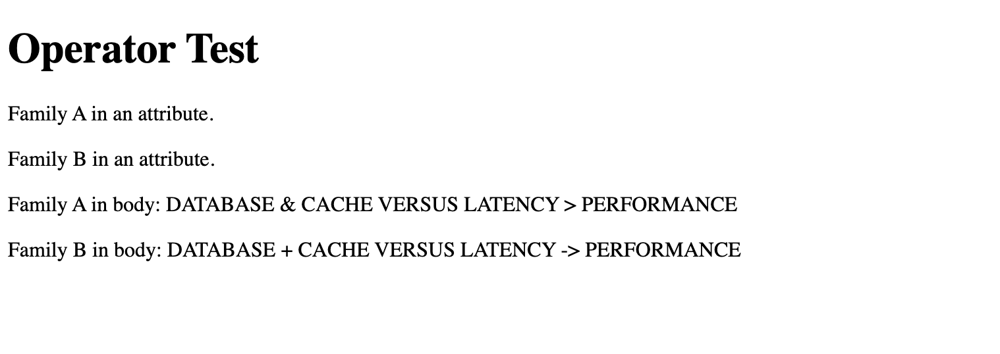
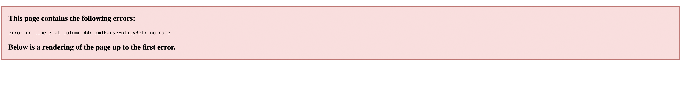
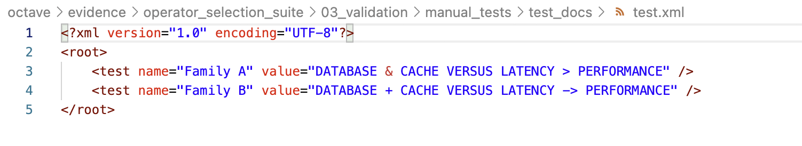
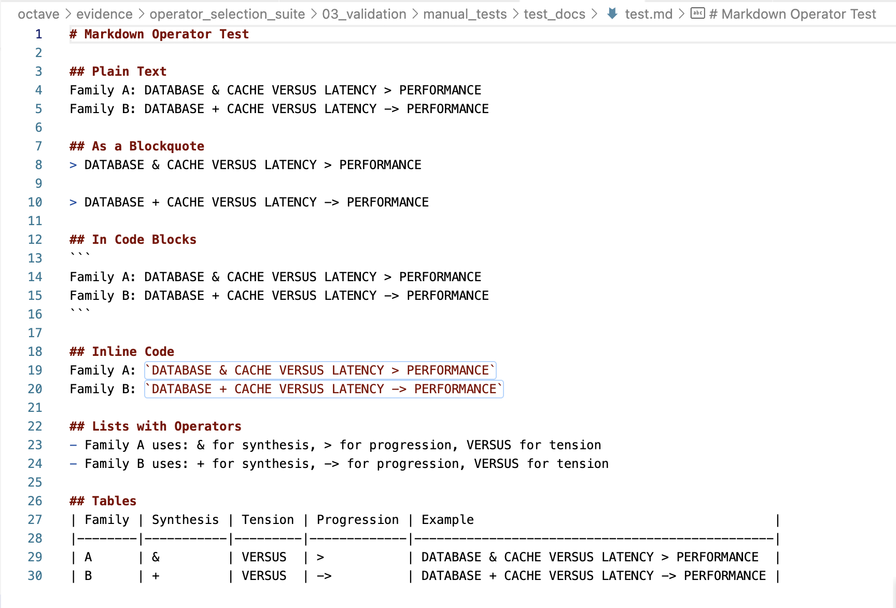

# Manual Test Results

**Date:** 2025-07-02
**Tester:** Claude (automated portions)

## Test Case 1: Git Diff Readability

### Git Diff Output

```diff
diff --git a/test.txt b/test.txt
index 2a869de..251a750 100644
--- a/test.txt
+++ b/test.txt
@@ -1,5 +1,5 @@
 # Family A
-DATABASE & CACHE VERSUS LATENCY > OLD_PERFORMANCE
+DATABASE & CACHE VERSUS LATENCY > NEW_PERFORMANCE
 
 # Family B
-DATABASE + CACHE VERSUS LATENCY -> OLD_PERFORMANCE
+DATABASE + CACHE VERSUS LATENCY -> NEW_PERFORMANCE
```

### Findings

*   **Both families display cleanly** in git diff without escaping issues
*   **Family A (`&`, `>`)**: Clear and readable, no confusion with diff markers
*   **Family B (`+`, `->`)**: Also clear, though `+` could momentarily be confused with diff's addition marker
*   **Conclusion**: No significant readability difference between families in git context
*   Full analysis saved in `test_results/git_diff_analysis.md`

## Test Case 2: IDE Syntax Highlighting (VS Code)

### Python Screenshot



### Python Findings

*   **Result**: ✅ **PASS** for both families
*   Both operator families display perfectly within string literals
*   No syntax highlighting anomalies or conflicts
*   Operators are treated as regular string content

### JavaScript Screenshot



### JavaScript Findings

*   **Result**: ✅ **PASS** for both families
*   Identical behavior to Python - clean display within strings
*   No interference with JavaScript syntax highlighting
*   Both families perform equally well

## Test Case 3: Markup Language Compatibility (HTML & XML)

### HTML Screenshot (Rendered Page)



### HTML Findings

*   **Result**: ✅ Both families display correctly in browsers
*   Family A (`&`): Renders properly (browser auto-corrects)
*   Family B (`+`): Renders properly
*   **Note**: Browser leniency masks the fact that `&` should be `&amp;` for valid HTML

### XML Findings

#### Chrome Browser Screenshot


#### VS Code XML Display


**⚠️ CRITICAL RESULTS:**

*   **Family A (`&`)**: ❌ **CATASTROPHIC FAILURE**
    - Chrome shows pink error box: "xmlParseEntityRef: no name"
    - Browser completely refuses to parse the XML
    - VS Code syntax highlighting shows the `&` as problematic
    - Requires escaping `&` as `&amp;` to work
    
*   **Family B (`+`)**: ✅ **PERFECT PASS**
    - No errors in any context
    - Clean XML parsing
    - No escaping required

**Confirmed**: The `&` character is a critical flaw for XML compatibility

## Test Case 4: Markdown Rendering

### Markdown Screenshot



### Markdown Findings

*   **Result**: ✅ **PASS** for both families
*   **Critical Test - Blockquotes**: The `>` in Family A does NOT create nested blockquotes
*   Markdown parsers correctly distinguish between `>` as blockquote marker vs operator
*   Both families render perfectly in:
    - Plain text
    - Code blocks and inline code
    - Lists
    - Tables
*   No visual anomalies or parsing conflicts

---

## Overall Conclusion & Recommendation

### Test Results Summary

| Test | Family A (`&`, `>`) | Family B (`+`, `->`) | Winner |
|------|---------------------|----------------------|---------|
| Git Diff | ✅ Pass | ✅ Pass | Tie |
| IDE Syntax | ✅ Pass | ✅ Pass | Tie |
| HTML | ✅ Display works | ✅ Pass | Slight B advantage |
| **XML** | ❌ **FAILS** | ✅ Pass | **B wins decisively** |
| Markdown | ✅ Pass | ✅ Pass | Tie |

### Critical Finding

**Family A's `&` operator has a fatal flaw**: It breaks XML parsing entirely. This is not a minor inconvenience - it's a complete failure that would require constant escaping in any XML context.

### Final Recommendation

**Preferred Operator Family: Family B (`+`, `->`, `VERSUS`)**

**Justification**: 
1. **XML Compatibility**: Family B works in ALL contexts without escaping, while Family A catastrophically fails XML validation
2. **Universal Toolchain Support**: No escaping needed anywhere
3. **Equal Performance**: In all other tests, both families performed equally well
4. **Future-Proof**: Avoids the `&` character's special meaning in markup languages

The XML incompatibility of Family A is a showstopper for any system that might use XML-based configuration, web services, or data exchange.

